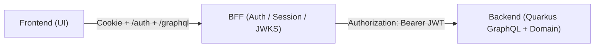

# MemberPulse 開発環境セットアップ

月謝制スタジオ向けの月次経営レビュー SaaS です。

## 1. プロジェクト構成と概要

- `migrate`: Liquibase ベースの DB マイグレーションと jOOQ 型生成
- `backend`: Quarkus ベースの GraphQL API サーバー
- `bff`: Hono ベースの認証/セッション/JWKS/GraphQL 中継
- `frontend`: React Router v7 ベースの Web フロントエンド
- `spec`: 仕様メモと計画書
- `profiles`: ローカル/検証/本番用の env テンプレート
- `.devcontainer`: Dev Container 定義と起動時の初期化スクリプト

### Front/BFF/Backend 連携イメージ



### Frontend/BFF/Backend の責務境界

- `frontend` は画面表示、入力体験、ローカル状態、クライアント側の導線制御を担当する
- `frontend` は `bff` の `/auth/*`、`/graphql`、`/runtime-config.json` を通じて業務操作を行う
- `frontend` は BFF に直接依存する認証境界を越えず、DB や Vault に触らない
- `bff` はセッション管理、JWT 署名、JWKS 公開、GraphQL 中継、郵便番号検索、ランタイム設定配信を担当する
- `backend` は業務ロジック、RLS 前提の DB アクセス、GraphQL スキーマ、認証関連ドメインを担当する
- `migrate` は DB スキーマ、seed、jOOQ 生成の唯一の正とする

## 実行環境の構成と概要

| 環境 | 役割 | 想定 |
| --- | --- | --- |
| local | 個人開発 | Dev Container + Docker + PostgreSQL + Vault + Redis |
| stg | 検証 | 共有検証環境 |
| prod | 本番 | 実運用環境 |

---

## 事前準備: GitHub 認証

`mise` は GitHub Releases からツールを取得するため、`gh` 認証を先に済ませておくと安定します。

```sh
gh auth login
gh auth status
```

必要なら現在のシェルで次も設定します。

```sh
export GITHUB_TOKEN="$(gh auth token)"
export MISE_GITHUB_TOKEN="$GITHUB_TOKEN"
```

Dev Container を使う場合は、ホスト側の `GITHUB_TOKEN` がコンテナへ引き継がれます。

## 2. Docker Engine セットアップ

このリポジトリは Docker Engine もしくは Docker Desktop のソケット共有を前提にしています。`/var/run/docker.sock` が利用できることを確認してください。

### インストール手順

```sh
sudo apt-get update
sudo apt-get install -y docker.io
sudo systemctl enable --now docker
sudo usermod -aG docker $USER
```

### 動作確認

```sh
docker info
groups
ls -l /var/run/docker.sock
```

### Dev Container のリビルド

Docker と GitHub 認証の準備ができたら、VS Code で Dev Container をリビルドします。

1. コマンドパレットを開く
2. `Dev Containers: Rebuild Container` を実行する

---

## 3. 事前準備

Dev Container の起動を前提にします。コンテナ起動時に `post-start.sh` が `member_pulse_dev` の作成と Vault 初期設定を行います。

### 2. 開発DB のセットアップ

DB 名は `member_pulse_dev` です。Dev Container 外で作業する場合は手動で作成してください。

```sh
psql -h postgres -p 5432 -U postgres -d postgres -c "CREATE DATABASE member_pulse_dev;"
```

### 3. 環境変数、認証鍵の登録

環境変数は `profiles/<profile>.env` で管理します。既定は `local` です。

```sh
cp -n profiles/template.env profiles/local.env
cp -n mise.local.toml.template mise.local.toml
```

その後、`mise trust` を実行します。

```sh
mise trust
```

Dev Container では `post-start.sh` が Vault の `secret/api` と `secret/edge` を投入します。コンテナ外で動かす場合は `VAULT_ADDR`、`VAULT_TOKEN`、`VAULT_TRANSIT_KEY`、DB 接続情報を自前で用意してください。

---

## 4. アプリケーション起動手順

### mise

このリポジトリでは `mise` を次の用途で使います。

- Java / Node.js / Ruby / Terraform / Vault / Task / just のバージョン固定
- `profiles/*.env` の読み分け
- 開発ツールの更新確認

現在の値を確認するには次を使います。

```sh
mise current
mise outdated
```

更新する場合は次を使います。

```sh
mise upgrade
```

必要ならシェルに再反映します。

```sh
eval "$(mise hook-env)"
```

### migrate（DB マイグレーション & コード生成）

`migrate` は DB スキーマ変更の起点です。`schemas` 配下は責務ごとに分かれています。

```sh
cd migrate
task help
```

よく使うコマンドは次です。

```sh
task up
task st
task validate
task diff
task sql
COUNT=1 task rb
TAG=checkpoint_YYYYMMDD_HHMMSS task rbt
task clear
```

jOOQ 生成と Java コンパイルをまとめて確認する場合は次を実行します。

```sh
./gradlew jooqCodegenWithTestcontainers compileJava
```

PostgreSQL JDBC ドライバが不足する場合は `migrate` ディレクトリで次を実行します。

```sh
liquibase lpm add -g postgresql
```

### backend（GraphQL API）

`backend` は Quarkus ベースの API サーバーです。`migrate` の生成型を前提にします。

```sh
cd backend
just dev
```

よく使う `just` ターゲットは次です。

```sh
just codegen
just compile
just test
just build
just fmt
just check
```

開発中の確認先は次です。

- GraphQL スキーマ: `http://localhost:8080/graphql/schema.graphql`
- GraphQL UI: `http://localhost:8080/q/graphql-ui/`
- Quarkus Dev UI: `http://localhost:8080/q/dev-ui`

### bff（認証/中継）

`bff` は認証境界と中継を担当します。

```sh
cd bff
pnpm install
pnpm run dev
```

ビルドと起動は次です。

```sh
pnpm run build
pnpm run start
```

主な公開口は次です。

- `POST /auth/*`
- `POST /graphql`
- `GET /.well-known/jwks.json`
- `GET /api/postal-code/lookup?zipcode=...`
- `GET /runtime-config.json`
- `GET /health`

### frontend（Web UI）

`frontend` は React Router v7 ベースの Web UI です。既存実装は HeroUI ベースで、GraphQL は生成済み SDK を使います。

```sh
cd frontend
pnpm install
pnpm run codegen
pnpm run dev
```

`pnpm run codegen` は backend の GraphQL スキーマを使うため、先に backend が起動している必要があります。

よく使うコマンドは次です。

```sh
pnpm run typecheck
pnpm run build
pnpm run lint
pnpm run format
pnpm run fix
pnpm run check
pnpm run codegen-http
```

---

## 5. データと命名

このリポジトリでは、業務名を次の方向で揃えます。

- `location`: スタジオ、店舗、教室、ジムなどの拠点
- `member`: 会員
- `lead`: 見込み客、問い合わせ
- `trial_session`: 体験レッスン、体験セッション
- `membership_plan`: 月額プラン
- `membership_subscription`: 会員のプラン契約履歴
- `monthly_review`: 月次レビュー
- `cost_item`: 費用マスタ
- `ad_spend`: 広告費

補足ルールは次の通りです。

- 共通マスタは `code` 主キーを使う
- 会社固有・業務固有データは `VARCHAR(21)` の nanoid 形式を使う
- `location` は郵便番号から住所補完しやすいように `zip_code`、`prefecture_code`、`address` を持つ
- `juku-ops` の `student`、`guardian`、`school`、`lesson`、`billing` などの塾文脈は新規実装へ持ち込まない

---

## 6. よく使う確認項目

- 変更前に `spec/target/monthly-review-saas-plan.md` を確認する
- `migrate/README.md` を見てから DB 変更を行う
- backend を触るなら `backend/README.md` を確認する
- frontend を触るなら `frontend/README.md` を確認する
- bff を触るなら `bff/README.md` を確認する

---

## 7. 補足

- `juku-ops` 由来のコードやドキュメントは参考として残っていますが、新機能の実装方針はこのリポジトリの仕様に従います
- 生成物や自動整形ファイルは直接編集しません
- 詳細な運用は各サブプロジェクトの README を参照します
